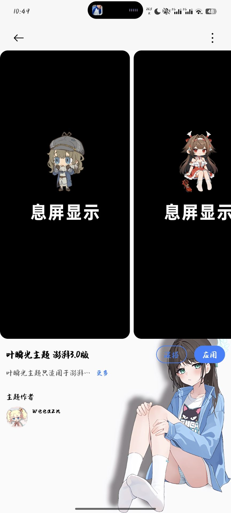
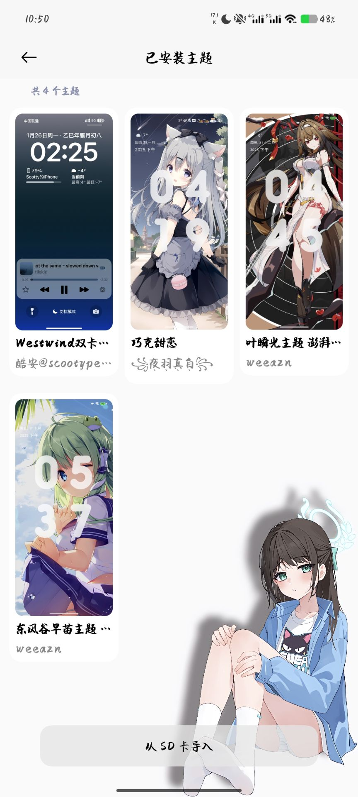
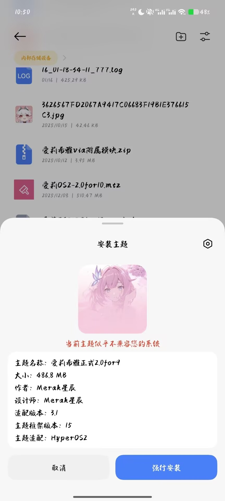
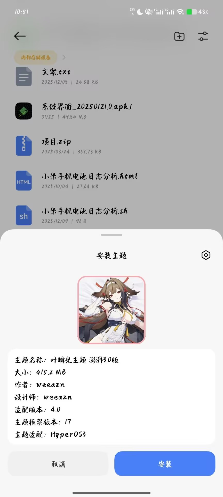
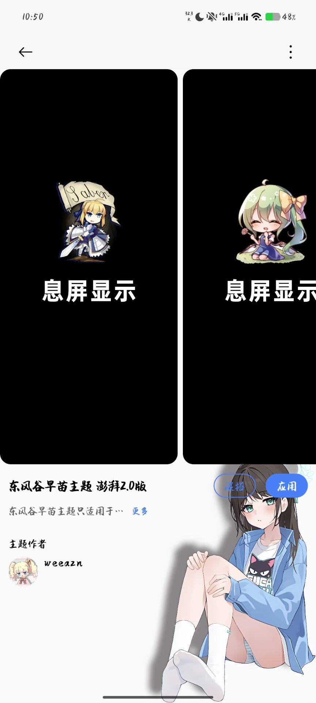

# ThemeStore（历史存档项目）

> ⚠️ 本项目为历史性遗留的测试项目，已停止维护，不建议继续编译或投入实际使用。

## 项目状态

- 本仓库仅用于历史留档与技术参考。
- 现有代码包含实验性实现，功能和兼容性均不再保证。
- 作者已转向开发新 APP，本项目不再更新，新app估计春节前后的事情

## 新项目方向

新项目是专门为**澎湃系统（HyperOS）**打造的第三方主题商店，当前支持：
- 无 Root 安装主题
- 导入主题
- 删除主题
- 在 APP 内直接应用主题

目前还在开发“混搭”功能

## 预览图

## 免责声明

本仓库内容仅供学习交流，请勿用于生产或商业用途。
